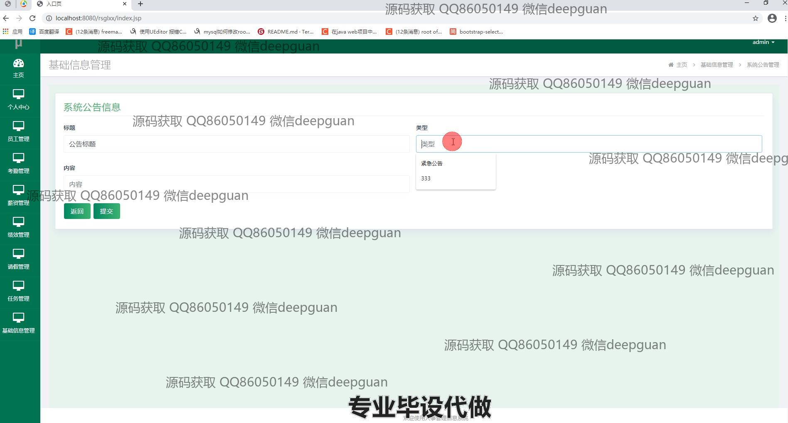
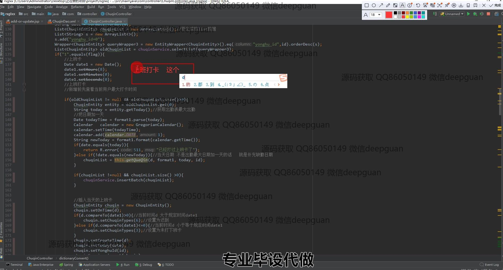

<h1 align="center">人事管理信息系统</h1>

## 简介
人事管理信息系统：角色分为管理员、用户；功能包括员工信息管理、考勤管理、薪资管理、绩效管理、请假管理、任务管理，有效提高人事工作的效率与准确性。    --计算机毕业设计源码；毕设源码；java毕业设计源码

## 联系方式

<h3 align="center">获取完整代码与数据库文件 + 微信：deepguan QQ: 86050149 QQ群: 783742310</h3>

<h3 align="center">可帮忙远程部署 包运行成功！提供远程部署、修改代码、设计文档指导、代码讲解等服务！</h3>

## 功能介绍（完整见运行截图）
管理员：管理员可以登录系统并访问主页，随即可以导航至各个管理模块，包括员工管理、部门管理、职位管理和考勤管理等。管理员能够查看和编辑员工的基本信息，如姓名、职位、身份证号等，并可以进行员工的增删改查操作。管理员还负责管理部门和职位信息，确保组织架构的准确性。此外，管理员可以查看员工的考勤记录，并管理薪资和绩效信息，以便系统化地进行人事决策和管理。

员工：员工可以通过登录界面进入个人中心，查看和修改自己的基本信息，诸如联系方式和部门职位等信息。员工可以使用考勤管理模块来记录每日的出勤情况，包括上下班打卡及查看自己的考勤记录。员工还可以提交和管理自己的请假请求，并查看审批状态。系统提供了一个简洁明了的用户界面，以便员工获取自身的相关信息并进行必要的交互。

## 运行截图

本代码来源于网络,仅供学习参考使用!

